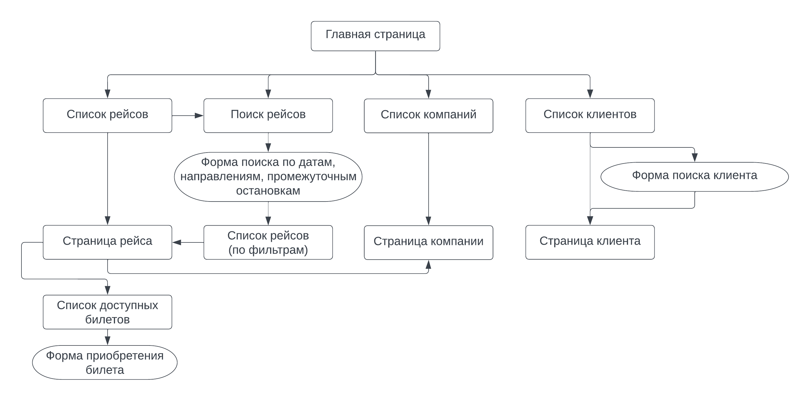

# Система информации об автобусных рейсах и билетах

## Описание страниц

С любой страницы можно перейти на главную.

### Главная страница

* Ссылка на список всех существующих рейсов
* Ссылка на страницу поиска рейсов с учетом фильтров (по датам, направлениям, промежуточным остановкам)
* Ссылка на список всех компаний
* Ссылка на список всех клиентов

### Список рейсов

* Представляет собой таблицу, содержащую информацию обо всех рейсах
* Каждая строка ведет на соответствующую ей страницу выбранного рейса
* Можно также перейти на страницу поиска рейсов по ссылке
* Имеется кнопка для создания нового рейса

### Поиск рейсов

* Содержит форму, которая позволяет найти рейсы, удовлетворяющие фильтрам
* Можно указать дату и время отправления/прибытия, пункты отправления и прибытия, промежуточные остановки
* Результат поиска будет выдан в виде страницы списка рейсов, где строками таблицы уже будут только те рейсы, что удовлетворяют критериям поиска

### Страница рейса

* Содержит подробную информацию о рейсе, в том числе время прибытия во все промежуточные остановки
* Ссылка на страницу компании, выполняющую данный рейс
* Ссылка на страницу списка доступных на этот рейс билетов

### Список билетов

* Представляет собой список билетов (доступных мест), которые можно купить
* Содержит форму для приобретения билета
* Если указанные данные клиента не присутствуют в базе, автоматически создается новый клиент

### Список клиентов

* Представляет собой список всех зарегистрированных в системе клиентов
* Имеется кнопка для перехода на форму создания нового клиента
* Имеется кнопка для перехода на форму поиска клиента по фильтрам
* Каждая строка списка есть гиперссылка на страницу клиента

### Страница клиента

* Подробная информация о клиенте: полные ФИО, дата рождения, электронная почта, телефон, список всех приобретенных когда-либо билетов
* Кнопка для редактирования информации о клиенте
* Кнопка для удаления данного клиента

### Список компаний

* Представляет собой список всех зарегистрированных в системе компаний
* Каждая строка списка есть гиперссылка на страницу выбранной компании
* Имеется кнопка для перехода на форму создания новой компании

### Страница компании

* Подробная информация о компании: наименование, дата создания, список рейсов данной компании
* Кнопка для редактирования информации о компании
* Кнопка для удаления компании

## Схема базы данных
