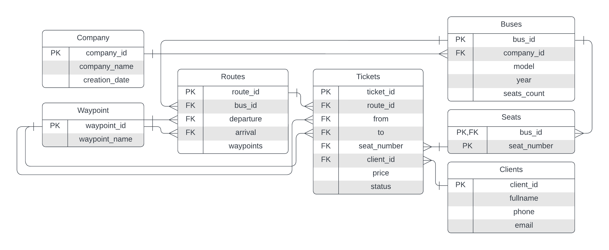

# Система информации об автобусных рейсах и билетах

## Описание страниц

С любой страницы можно перейти на главную.

### Главная страница

* Ссылка на список всех существующих рейсов
* Ссылка на страницу поиска рейсов с учетом фильтров (по датам, направлениям, промежуточным остановкам)
* Ссылка на список всех компаний
* Ссылка на список всех клиентов

### Список рейсов

* Представляет собой таблицу, содержащую информацию обо всех рейсах
* Каждая строка ведет на соответствующую ей страницу выбранного рейса
* Можно также перейти на страницу поиска рейсов по ссылке
* Имеется кнопка для создания нового рейса

### Поиск рейсов

* Содержит форму, которая позволяет найти рейсы, удовлетворяющие фильтрам
* Можно указать дату и время отправления/прибытия, пункты отправления и прибытия, промежуточные остановки
* Результат поиска будет выдан в виде страницы списка рейсов, где строками таблицы уже будут только те рейсы, что удовлетворяют критериям поиска

### Страница рейса

* Содержит подробную информацию о рейсе, в том числе время прибытия во все промежуточные остановки
* Ссылка на страницу компании, выполняющую данный рейс
* Ссылка на страницу списка доступных на этот рейс билетов

### Список билетов

* Представляет собой список билетов (доступных мест), которые можно купить
* Содержит форму для приобретения билета
* Если указанные данные клиента не присутствуют в базе, автоматически создается новый клиент

### Список клиентов

* Представляет собой список всех зарегистрированных в системе клиентов
* Имеется кнопка для перехода на форму создания нового клиента
* Имеется кнопка для перехода на форму поиска клиента по фильтрам
* Каждая строка списка есть гиперссылка на страницу клиента

### Страница клиента

* Подробная информация о клиенте: полные ФИО, дата рождения, электронная почта, телефон, список всех приобретенных когда-либо билетов
* Кнопка для редактирования информации о клиенте
* Кнопка для удаления данного клиента

### Список компаний

* Представляет собой список всех зарегистрированных в системе компаний
* Каждая строка списка есть гиперссылка на страницу выбранной компании
* Имеется кнопка для перехода на форму создания новой компании

### Страница компании

* Подробная информация о компании: наименование, дата создания, список рейсов данной компании
* Кнопка для редактирования информации о компании
* Кнопка для удаления компании

## Схема базы данных

## Сценарии использования

### Получение списка рейсов по датам, направлениям и промежуточным остановкам, информации о ценах билетов и наличии свободных мест

* Перейти на страницу поиска рейсов
* Указать все необходимые фильтры в форме поиска
* Нажать кнопку "Поиск"
* Результат будет в виде списка рейсов
* Для выбранного рейса перейти на его страницу, нажав на соответствующую строку списка
* Перейти на страницу списка всех доступных билетов с указанной ценой

### Получение списка клиентов, в т.ч. ехавших определенным рейсом, любыми рейсами компании, заказавших билеты

* Перейти на страницу списка всех клиентов
* В форме поиска клиентов указать все необходимые фильтры
* Нажать кнопку "Поиск"

### Получение истории заказов клиента

* Перейти на страницу списка всех клиентов
* (опционально) Найти нужного клиента, используя форму поиска
* Перейти на страницу выбранного клиента
* Все заказы данного клиента будут отображены списком на его странице

### Заказ билетов на выбранный рейс между выбранными пунктами
* Провести все те же действия, что и для поиска рейса
* На странице списка всех билетов найти необходимый билет
* Заполнить форму заказа билета

### Добавление и удаление рейса, чтение и редактирование данных о нем
Для добавления рейса:
* Перейти на страницу списка всех рейсов
* Нажать на кнопку "Добавить"
* Заполнить все поля формы

Для изменения или удаления рейса:
* Перейти на страницу списка всех рейсов
* Найти нужный рейс и перейти на его страницу
* Нажать кнопку "Редактировать" для изменения рейса или "Удалить" для удаления

### Добавление и удаление клиента, чтение и редактирование данных о нем
Для добавления клиента:
* Перейти на страницу списка всех клиентов
* Нажать на кнопку "Добавить"
* Заполнить все поля формы

Для изменения или удаления клиента:
* Перейти на страницу списка всех клиентов
* Найти нужного клиента и перейти на его страницу
* Нажать кнопку "Редактировать" для измененияи информации о клиенте или "Удалить" для удаления